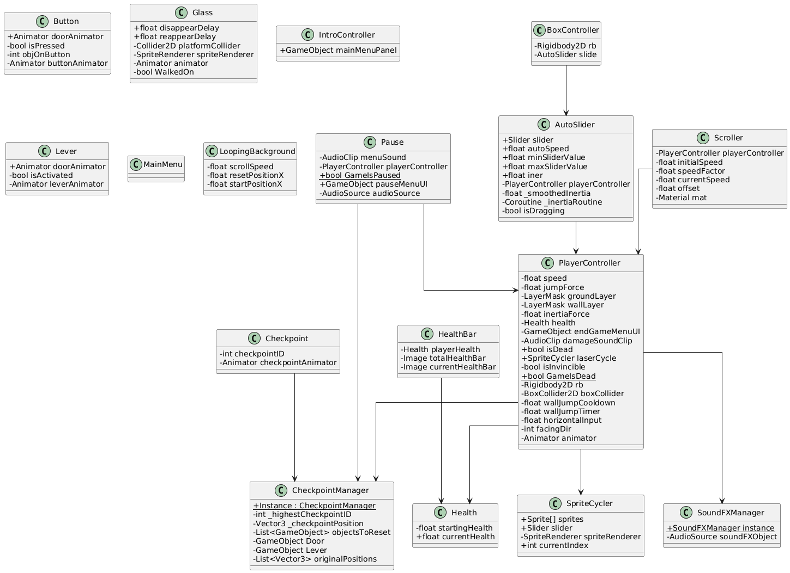

# Ticket2Ride_2D

Ticket2Ride_2D is a small 2D platformer built with Unity. You control a character that runs and jumps through obstacles, activates levers and buttons, and collects checkpoints to respawn when defeated.

## Features
- Classic platformer movement with wall jumping
- Health system and on-screen health bar
- Pause menu and end-game screen
- Auto-moving slider that influences player inertia
- Background and object scrolling, disappearing platforms, levers, and buttons
- Basic sound effects and music

## Project Structure
- **Assets/** – game scenes, scripts, sprites, sounds, and shaders
- **Packages/** – Unity package manifest
- **ProjectSettings/** – Unity project configuration

Important scenes are defined in `ProjectSettings/EditorBuildSettings.asset`, such as *MainMenu* and *Tutorial*.

## Requirements
- Unity Editor 6000.0.30f1 (or newer). The `Packages/manifest.json` file lists dependencies like Cinemachine, the Input System, and URP.

## Getting Started
1. Clone the repository.
2. Open Unity Hub, select **Add** and choose the project folder.
3. Open the *MainMenu* scene and press **Play**.

## Controls
- **Move:** Arrow keys or A/D
- **Jump:** Space
- **Pause:** Esc

The inertia slider in the UI can be dragged (or left to auto-scroll) to change how strongly the background and certain objects scroll.

## Building
Use `File > Build Settings` in the Unity editor to create a standalone build for your target platform.

## Class Diagram

## Demo
See the full demo on [GitHub Pages](https://dainiusgelzinis.github.io/Ticket2Ride_2D/).

